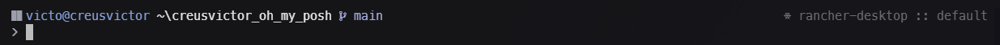

# My Custom Oh My Posh Theme



This repository contains a custom theme for [Oh My Posh](https://ohmyposh.dev/), designed to provide a sleek and functional interface for your terminal.

## Table of Contents

- [Features](#features)
- [Color Palette](#color-palette)
- [Included Segments](#included-segments)
- [Installation](#installation)
- [Customization](#customization)

---

## Features

- Designed with a modern and minimalist aesthetic.
- Soft, customized colors for better readability.
- Displays key information such as OS, username, path, and Git status.
- Decorative final segment.

---

## Color Palette

The theme uses a palette that combines elegant and versatile tones:

| Color       | Hex       |
|-------------|-----------|
| OS          | `#ACB0BE` |
| Closer      | `p:os`    |
| Grey        | `#696969` |
| White       | `#FFFFFF` |
| Lavender    | `#B4BEFE` |
| Blue        | `#89B4FA` |
| Red         | `#FF0000` |

---

## Included Segments

### Left Block (Main)
- **Operating System**: Displays a representative icon.
- **Session**: Shows the username and hostname.
- **Path**: Indicates the current path using the `agnoster_short` style.
- **Git**: Displays repository status information like branch, commits, and more.

### Right Block
- **SHELL**: Displays the active shell.
- **TIME**: Displays the execution time.

### Bottom Block
- A simple decorative separator.

---

## Installation

Follow these steps to install this theme in your Oh My Posh setup:

1. **Clone this repository or download the theme file**
   ```bash
   git clone https://github.com/your-username/oh-my-posh-custom-theme.git
   ```
2. **Save the theme file in an accessible location.** For example, `~/.poshthemes/custom-theme.json`.

3. **Update your Oh My Posh configuration to use this theme:**
   ```bash
   oh-my-posh init pwsh --config ~/.poshthemes/custom-theme.json | Invoke-Expression
   ```

4. **Set up your shell to apply the theme automatically.** Make sure to include the command above in your configuration file (`.bashrc`, `.zshrc`, or `profile.ps1`).

---

## Customization

To tailor this theme to your preferences:

1. **Edit the JSON file:** You can easily modify the color palette or segments.
2. **Check the documentation:** Learn more about customizing your prompt in the [official Oh My Posh documentation](https://ohmyposh.dev/docs).

---

## License

This project is licensed under the MIT License. See the `LICENSE` file for details.

---

Enjoy your terminal with style and functionality thanks to this Oh My Posh theme! If you have ideas or suggestions, feel free to open an issue or pull request.
